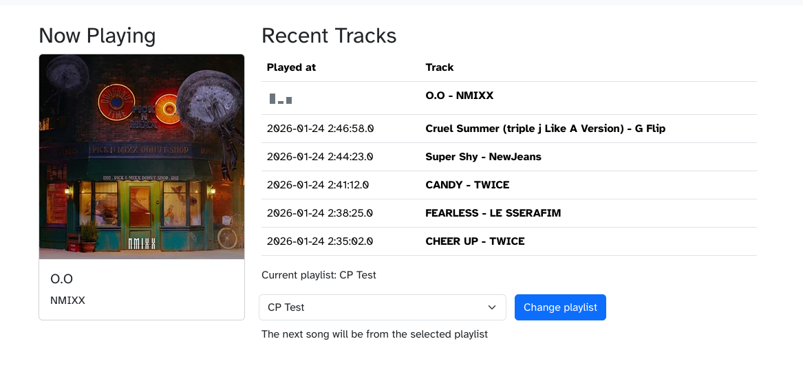

# Campus Playout 2026

Yet another Campus Playout implementation. Will it succeed? Who knows!



## About

### Stack

- [Liquidsoap](https://www.liquidsoap.info) (actually does the audio stuff)
- [mediamtx](https://mediamtx.org) (HLS streaming)
- [Rust](https://rust-lang.org) + [axum](https://docs.rs/axum/latest/axum/) (backend)
- [sqlite](https://sqlite.org) (database)
- [maud](https://maud.lambda.xyz) (HTML templating)
- [htmx](https://htmx.org) (frontend interactivity)
- [Bootstrap](https://getbootstrap.com) (UI styling)

## Development

### You will need

- A [last.fm](https://last.fm) API key
- A MyRadio API key
- A rust toolchain
- Liquidsoap
- The sqlx-cli (`cargo install sqlx-cli`)
- mediamtx server with SRT and HLS enabled

### Configuration

Create a `.env` file with the following content:

```
DATABASE_URL=sqlite:database.db

INSTANCE_NAME="Test Venue"

LAST_FM_API_KEY=

MYRADIO_API_BASE=https://ury.org.uk/api/v2
MYRADIO_API_KEY=

PLAYLIST_CATEGORY_ID=3
DEFAULT_PLAYLIST_ID=pop-

JINGLES_FILE=/data/jingles.txt
MORNING_JINGLES_FILE=/data/morning-jingles.txt
AFTERNOON_JINGLES_FILE=/data/afternoon-jingles.txt
EVENING_JINGLES_FILE=/data/evening-jingles.txt

PLAYLIST_FILE=./playlist-gen.txt

API_TOKEN=changeme

SRT_HOST=mediamtx
SRT_PORT=8890
SRT_USERNAME=username
SRT_PASSWORD=password
SRT_STREAM_ID=test-venue
HLS_BASE_URL=http://mediamtx:8888
```

Loading the `.env` file is up to you.

### Database

Create the database with `sqlx database create`.

### Running

Run the Rust control server with `cargo run`.

Start the liquidsoap script with `liquidsoap scripts/playout.liq`.
